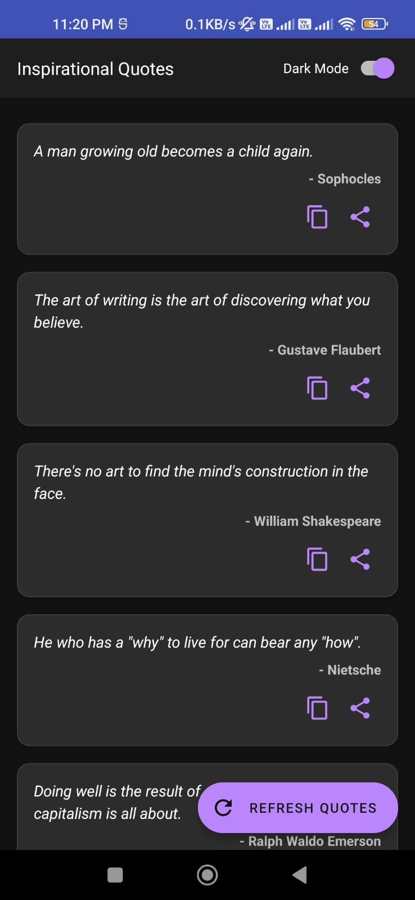

# FavQs-Quote-App

FavQs Quote App is an Android application that uses the FavQs API to display random inspirational quotes. The app fetches quotes from the API and shows them in a simple, user-friendly UI. Users can view new quotes by refreshing the page, making this app perfect for daily inspiration.

Features:
Fetches random quotes from the FavQs API.
Displays quotes with author names.
Simple, intuitive user interface.
Button to refresh and get a new quote.
Technologies Used:
API: FavQs API
Language: Java/Kotlin
UI Framework: Android SDK
Network: Retrofit for API calls

## Screenshots

*Home screen with random quote*

*Refreshing to get a new quote*

